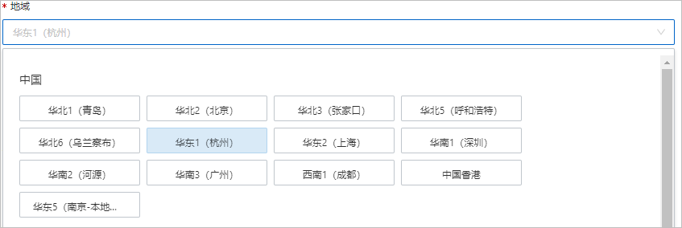

麒麟CRM-计算巢模式部署文档 
============================================
>**免责声明：**本文档可能包含第三方产品信息，该信息仅供参考。阿里云对第三方产品的性能、可靠性以及操作可能带来的潜在影响，不做任何暗示或其他形式的承诺。

概述 
-----------------------

数云麒麟是针对中大型企业的消费者运营CRM，凭借强大的产品能力，实现全渠道数据收集和全链路消费者资产化运营，赋能企业数字化建设，驱动全域消费者增长。本文介绍部署麒麟CRM-阿里云k8s服务实例的详细说明。

RAM账号所需权限 
------------------------------

麒麟CRM服务需要对ECS、VPC、OSS等资源进行访问和创建操作，若您使用RAM账号创建服务实例时，需在创建服务实例前，对使用的RAM账号添加相应资源的权限。添加RAM权限的详细操作，请参见[为RAM用户授权](https://help.aliyun.com/document_detail/116146.html)。

|         权限策略名称          |               备注               |
|-------------------------|--------------------------------|
| AliyunVPCFullAccess     | 管理专有网络（VPC）的权限                 |
| AliyunCSFullAccess      | 管理容器服务（CS）的权限                  |
| AliyunECSFullAccess     | 管理云服务器服务（ECS）的权限               |
| AliyunRDSFullAccess     | 管理云数据库服务（RDS）的权限               |
| AliyunPolardbFullAccess | 管理云数据库PolarDB的权限               |
| AliyunKvstoreFullAccess | 管理云数据库Redis版（Kvstore）的权限       |
| AliyunGPDBFullAccess    | 管理AnalyticDB for PostgreSQL的权限 |
| AliyunOSSFullAccess     | 管理对象存储服务（OSS）权限                |
| AliyunDTSFullAccess     | 管理数据传输服务（DTS）的权限               |
| AliyunSLBFullAccess     | 管理负载均衡服务（SLB）的权限               |
| AliyunLogFullAccess     | 管理日志服务（Log）的权限                 |

麒麟CRM-阿里云K8s服务资源配置 
---------------------------------------

在部署服务实例时，服务将自动在您的账号下创建所需的云资源。服务资源的默认配置如下。

* 3台16 vCPU 32 GiB的ECS实例

* 1台4 vCPU 8 GiB的ECS实例

* 1台1 vCPU 1 GiB的RDS MySQL实例

* 1台1 GiB的Redis 实例

* 1台4 vCPU 16 GiB的PolarDB MySQL实例

* 1台2 vCPU 16 GiB的AnalyticDB PostgreSQL版实例

* 标准存储对象存储OSS bucket

* DTS数据订阅实例（PolarDB MySQL）

* 按量付费规格CLB/SLB实例

部署流程 
-------------------------

**部署步骤**

单击[部署链接](https://computenest.console.aliyun.com/user/cn-hangzhou/serviceInstanceCreate?ServiceId=service-edc4201fe08a4d0a82f1)，在部署界面填写相应的参数，完成部署。

**部署参数说明**

您可以通过服务商在计算巢中发布的服务，一键部署阿里云资源和服务商提供的软件。在创建服务实例的过程中，需要配置服务实例信息，下文介绍麒麟CRM-阿里云k8s服务需要配置的详细参数及注意事项。

* **地域**

  请结合实际情况选择合适的地域。
  

* **ACK信息**

  ACK信息的参数配置参数如下：
  

  |        配置项        |                                                                        参数说明                                                                         |
  |-------------------|-----------------------------------------------------------------------------------------------------------------------------------------------------|
  | 环境类型              | 根据实际情况选择合适的环境。                                                                                                                                      |
  | 选择VPC             | 选择ACK集群所在的VPC，根据实际情况选择合适的VPC。                                                                                                                       |
  | 选择kubernetes版本    | 选择kubernetes的版本，建议选择最新的版本。                                                                                                                          |
  | 选择容器运行时           | 选择容器运行时，默认选择docker。 容器运行时的详细信息，请参见[如何选择Docker运行时、Containerd运行时、或者安全沙箱运行时？](https://help.aliyun.com/document_detail/160313.html)。 |
  | Worker交换机         | 选择Worker交换机。当前选择一个，后期可通过维护的方式扩展交换机数量。                                                                                                               |
  | Pod交换机            | 选择Pod交换机。当前选择一个，后期可通过维护的方式扩展交换机数量。 **重要** 此交换机需要Pod专用，不能与Worker交换机相同。                                                                               |
  | Service网段         | 选择Ack集群的Service网段，不能与VPC所在网段相同。                                                                                                                     |
  | 购买时长（月）           | 填写Ack集群Worker节点的购买时长，单位：月。                                                                                                                          |
  | ACK Worker节点数     | Ack集群Worker节点数量，默认为3，取值范围为2\~300。                                                                                                                   |
  | worker实例规格        | 选择Ack集群Worker节点的实例规格，默认选择ecs.sn1ne.4xlarge=16vCPU32Gib（计算网络增强型） 建议您保持默认值或选择ecs.c6.4xlarge=16vCPU32Gib（计算型c6）。若您未找到上述实例规格，可咨询数云工程师选择其他类型。            |
  | ACK Worker节点系统盘类型 | 若无较高的I/O需求，选择\[cloud_efficiency: 高效云盘\]即可。                                                                                                          |
  | ACK Worker节点数据盘类型 | 若无较高的I/O需求，选择\[cloud_efficiency: 高效云盘\]即可。                                                                                                          |

  

* **麒麟PaaS中间件ECS信息**

  麒麟PaaS中间件ECS信息的参数配置如下：
  

  |        配置项        |                                                                                        参数说明                                                                                        |
  |-------------------|------------------------------------------------------------------------------------------------------------------------------------------------------------------------------------|
  | PAAS ECS实例采购选项    | 选择是否采购ECS实例。默认为YES。 * YES：采购ECS实例。  * NO：不采购ECS实例。                                            |
  | ECS交换机可用区         | 选择ECS交换机的可用区。 **说明** 选择前请确认该可用区是否支持创建ECS资源的规格，建议与其他交换机可用区不同。                                                                                                                       |
  | ECS网络交换机ID        | 选择现有业务网络交换机的实例ID。                                                                                                                                                                  |
  | ECS镜像ID           | 选择ECS镜像的ID。建议选择的镜像操作系统为：CentOS 7.9 64位。                                                                                                                                            |
  | ECS实例规格           | 请选择c系列主机，如可用区无ecs.c5计算系列主机，可选择其他类型的ecs.c系列主机，例如ecs.c6.\*                                                                                                                           |
  | 系统盘空间             | 设置系统盘空间的大小。默认值为：40，取值范围：\[40, 500\]，单位：GB。                                                                                                                                         |
  | 系统盘类型             | 选择系统盘的类型。若无较高的I/O需求，选择\[cloud_efficiency: 高效云盘\]即可。                                                                                                                                |
  | ECS数据盘大小          | 设置ECS数据盘的大小。默认值为500。单位GB。                                                                                                                                                          |
  | ECS数据盘类型          | 选择ECS数据盘类型。若无较高的I/O需求，选择\[cloud_efficiency: 高效云盘\]即可。                                                                                                                              |
  | ECS购买资源时长周期       | 选择ECS购买资源时长的周期。默认值为Month。                                                                                                                                                          |
  | ECS购买资源时长         | 选择ECS购买资源时长。 * 当购买资源时长周期为Week时，时长的取值为：1\~4。  * 当购买资源时长为周期Month时，时长的取值为：1\~9、12、24、36、48、60。   |
  | SecurityGroupName | 设置安全组名称。名称组成为2\~128个中英文字符，不能以数字开头，可包含'_' 或 '.'，'-'。 数云内置安全组名称为kylinSecurityGroup-随机ID，您也可以自行制定，但是名称后会追加随机ID。 购买的ECS会自动添加至该安全组，如有其他需求可在生成后手动调整。                     |
  | 快照策略名称            | 设置快照策略名称。名称组成为2\~128个中英文字符，必须是中文字符或者英文字符开头，可以包含数字、半角句号（.）、半角冒号（:）、下划线（_）、短划线（-）。                                                                                                   |
  | 自动快照备份周期          | 设置自动快照备份的周期。默认规则为：每周1、3、5、7日自动快照备份。                                                                                                                                                |
  | 快照保留时间            | 设置快照保留时间。默认值为：90，单位：天。取值范围：-1\~65535，其中-1表示不删除。                                                                                                                                    |
  | 快照备份时间点           | 设置自动快照的创建时间点。默认值为：3，单位：时。取值范围：0\~23。                                                                                                                                               |
  | ECS实例个数           | 设置一次性创建ECS实例的个数。默认值为：3。 因高可用保障，建议保持默认值。                                                                                                                                            |

  

  

* **Rds信息**

  Rds信息的参数配置如下：
  

  |     配置项     |                                                                             参数说明                                                                             |
  |-------------|--------------------------------------------------------------------------------------------------------------------------------------------------------------|
  | RDS采购选项     | 选择是否采购RDS数据库。默认为：YES。 * YES：采购RDS数据库。  * NO：不采购RDS数据库。                  |
  | Rds交换机可用区   | 选择Rds交换机可用区。 **说明** 选择前请确认该可用区是否支持创建Rds资源的规格，建议与其他交换机可用区不同。                                                                                                  |
  | Rds交换机      | 选择Rds的交换机。建议和ACK集群worker、pod选择不同的交换机。                                                                                                                        |
  | Rds Mysql版本 | 选择RDS MySQL的版本。默认值为：8.0，可选值为：5.6、8.0。                                                                                                                        |
  | Rds购买周期     | 选择RDS购买的周期类型。默认值为：Month。可选值为：Month、Year。                                                                                                                     |
  | Rds购买时长（月）  | 选择RDS购买的时长。 * 当购买类型选择为Month时，取值范围为：1\~9。  * 当购买类型选择为Year时，取值范围为：1\~3。   |

  

  

* **PolarDB信息**

  PolarDB信息的参数配置如下：
  

  |         配置项         |                                                                       参数说明                                                                       |
  |---------------------|--------------------------------------------------------------------------------------------------------------------------------------------------|
  | PloarDB购买选项         | 选择是否采购PloarDB。默认为：YES。 * YES：采购PloarDB。  * NO：不采购PloarDB。   |
  | 麒麟租户ID              | 设置麒麟租户ID。 该租户ID会构成麒麟数据模型数据库的前缀。                                                                                                                  |
  | PloarDB交换机可用区       | 选择PloarDB交换机的可用区。 **说明** 选择前请确认该可用区是否支持创建PolarDB资源的规格，建议与其他交换机可用区不同。                                                                             |
  | PolarDB交换机          | 选择PolarDB交换机。建议和ACK集群worker、pod选择不同的交换机。                                                                                                         |
  | PolarDB Mysql版本     | 选择PolarDB MySQL的版本。默认值为：8.0，取值范围为：5.6、8.0。                                                                                                       |
  | PolarDB Mysql资源规格大小 | 根据配置需求选择PolarDB MySQL资源规格大小。PolarDB MySQL资源规格大小的详细信息，请参见[计算节点规格](https://help.aliyun.com/document_detail/102542.html)。        |
  | PloarDB购买时长（月）      | 选择PloarDB的购买时长。可选值为1\~9、12、24、36。                                                                                                                |

  

* **CRM Redis信息**

  CRM Redis信息的参数配置如下：
  

  |       配置项       |                                                                          参数说明                                                                          |
  |-----------------|--------------------------------------------------------------------------------------------------------------------------------------------------------|
  | CRM Redis实例购买选项 | 选择是否采购CRM Redis。默认为：YES。 * YES：采购CRM Redis。  * NO：不采购CRM Redis。   |
  | Redis交换机可用区     | 选择Redis交换机的可用区。 **说明** 选择前请确认该可用区是否支持创建Redis资源的规格，建议与其他交换机可用区不同。                                                                                       |
  | Redis交换机        | 选择Redis的交换机。建议和ACK集群worker、pod选择不同的交换机。                                                                                                                |
  | Redis版本         | 选择Redis的版本。默认值为：4.0，可选值为：4.0、5.0。                                                                                                                      |
  | Redis购买时长（月）    | 选择Redis的购买时长。可选值为：1-9、12、24、36。                                                                                                                        |
  | Redis实例规格       | 选择Redis的实例规格。 Redis资源规格大小根据配置不同，不同的用户支持规格可能不尽相同。规格的详细信息，请参见[规格查询导航](https://help.aliyun.com/document_detail/26350.html)。            |

  

* **NewBiRedis信息**

  NewBiRedis信息的参数配置如下：
  

  |        配置项        |                                                                             参数说明                                                                             |
  |-------------------|--------------------------------------------------------------------------------------------------------------------------------------------------------------|
  | NewBi Redis实例购买选项 | 选择是否采购NewBi Redis。默认为：YES。 * YES：采购NewBi Redis。  * NO：不采购NewBi Redis。   |
  | NewBi Redis实例规格   | 选择NewBi Redis的实例规格。 NewBi Redis资源规格大小根据配置不同，不同的用户支持规格可能不尽相同。规格的详细信息，请参见[规格查询导航](https://help.aliyun.com/document_detail/26350.html)。      |

  

* **ADB信息**

  ADB信息的参数配置如下：
  

  |    配置项     |                                                                              参数说明                                                                               |
  |------------|-----------------------------------------------------------------------------------------------------------------------------------------------------------------|
  | ADB购买选项    | 选择是否采购ADB实例。默认为：YES。 * YES：采购ADB实例。  * NO：不采购ADB实例。                        |
  | ADB交换机可用区  | 选择ADB交换机的可用区。 **说明** 选择前请确认该可用区是否支持创建ADB资源的规格，建议与其他交换机可用区不同。                                                                                                    |
  | ADB交换机     | 选择ADB使用的交换机。建议和ACK集群worker、pod使用不同的交换机。                                                                                                                         |
  | ADB实例规格    | 选择ADB实例的规格。可选值：2C16G、4C32G、16C128G。                                                                                                                             |
  | ADB节点数量    | 设置ADB节点的数量。取值范围为：4\~512。                                                                                                                                        |
  | ADB单节点存储容量 | 设置ADB单节点的存储容量。取值范围为：50\~4000，单位：GB。                                                                                                                             |
  | ADB主节点数量   | 选择ADB主节点的数量。可选值：1、2。                                                                                                                                            |
  | ADB购买时长    | 设置ADB的购买时长。 * 当购买时长的单位选择Month时，取值范围：1\~11。  * 当购买时长的单位选择Year时，取值范围：1\~3。   |
  | ADB购买时长单位  | 选择ADB购买时长的单位。取值范围：Month、Year。                                                                                                                                   |

  

* **OSS Bucket信息**

  OSS Bucket信息的参数设置如下：
  

  |      配置项       |                                                                           参数说明                                                                            |
  |----------------|-----------------------------------------------------------------------------------------------------------------------------------------------------------|
  | OSS Bucket新建选项 | 选择是否新建OSS Bucket。默认为：YES。 * YES：新建OSS Bucket。  * NO：不新建OSS Bucket。   |
  | OSS Bucket名称   | 设置OSS Bucket的名称。必须以小写字母或数字开头，长度限制为3\~63字符，默认为：kylincrm。                                                                                                   |

  

* **DTS信息**

  DTS信息的参数配置如下：
  

  |              配置项              |                                                                                参数说明                                                                                 |
  |-------------------------------|---------------------------------------------------------------------------------------------------------------------------------------------------------------------|
  | DTS采购选项                       | 选择是否采购DTS数据订阅。默认为：YES。 * YES：采购DTS数据订阅。  * NO：不采购DTS数据订阅。                      |
  | DTS购买时长                       | 设置DTS的购买时长。 * 当DTSPeriod选择Month时，取值范围：1\~11。  * 当DTSPeriod选择Year时，取值范围：1\~3。   |
  | DTSPeriod                     | 选择DTS购买时长的单位。可选值：Month、Year。                                                                                                                                        |
  | DTSPayType                    | 选择DTS的付费类型。可选值： * PrePaid：包年包月。  * PostPaid：按量付费。                              |
  | DTSSourceEndpointInstanceType | 设置DTS的订阅类型。默认值：PolarDB。若无特殊需求，可保持默认值。                                                                                                                               |

  

* **SLB/CLB信息**

  SLB/CLB信息的参数配置如下：
  

  |      配置项       |                                                                       参数说明                                                                       |
  |----------------|--------------------------------------------------------------------------------------------------------------------------------------------------|
  | SLB/CLB采购选项    | 选择是否采购SLB/CLB。默认为：YES。 * YES：采购SLB/CLB。  * NO：不采购SLB/CLB。   |
  | SLB/CLB名称      | 设置SLB/CLB名称。长度为1\~80个字符。可包含英文字母、数字、短划线（-）、正斜线（/）、半角句号（.）和下划线（_）。                                                                                 |
  | SLB/CLB IP地址类型 | 选择SLB/CLB IP地址的类型。默认值：ipv4。可选值：ipv4、ipv6。                                                                                                        |
  | SLB/CLB主可用区    | 选择SLB/CLB的主可用区。                                                                                                                                  |
  | SLB/CLB备可用区    | 选择SLB/CLB的备可用区。                                                                                                                                  |
  | SLB/CLB实例类型    | 选择SLB/CLB的实例类型。默认值：标准型l（slb.s2.small）。                                                                                                           |

  

